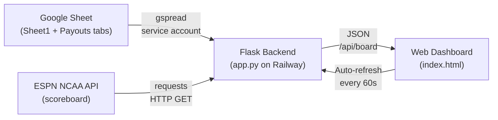
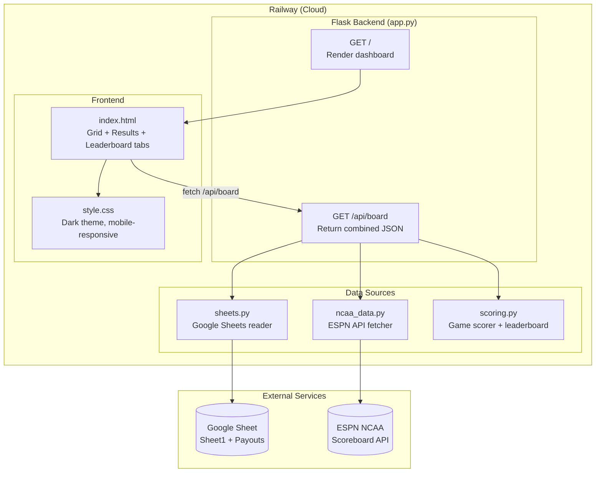
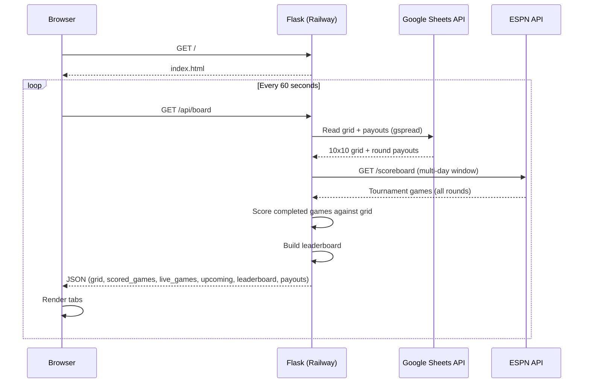

# NCAA Tournament Squares — Product Requirements Document

## Overview
A web dashboard for a March Madness squares pool that combines a 10x10 participant grid from a Google Sheet with live NCAA tournament game data from ESPN. Payouts are awarded based on the last digit of each team's score when a game ends. The app is deployed on Railway and accessible to all pool participants via a public URL.

**Live URL**: https://ncaa-squares-production.up.railway.app

## Problem
Running a tournament squares pool manually requires tracking 63 games across 3+ weeks, calculating which square wins each game, and updating a leaderboard by hand. Participants have no real-time visibility into live scores or who's winning the pool.

## Solution
A lightweight web app that reads the participant grid from a Google Sheet and enriches it with live ESPN tournament data, automatically scoring completed games and displaying a real-time leaderboard — no manual updates required.

## Users
- **Pool participants** — view the grid, track live scores, and see who's winning
- **Pool administrator** — maintains the Google Sheet with participant names and payout amounts

## Core Features

### 1. Squares Grid
- 10x10 grid displaying participant names per square
- Axes represent the last digit of the winner's score (columns) and loser's score (rows)
- Winning squares highlighted with distinct styling
- Each participant assigned a unique color across their squares

### 2. Results Tab
- Live games shown with real-time scores and game status
- Completed games grouped by round (Round of 64 → Championship)
- Each result shows: teams, seeds, final score, winning/losing digit, square owner, and payout
- First Four play-in games excluded from scoring entirely

### 3. Leaderboard
- Ranked by total winnings (highest first)
- Shows name, total winnings, and number of wins per participant

### 4. Auto-Refresh
- Dashboard refreshes every 60 seconds via JS fetch
- Timestamp shown for last update

## Scoring

- When a game ends, take the last digit of each team's final score
- Look up the square at (winner's last digit, loser's last digit)
- Award that square's owner the payout for that round
- **First Four play-in games do not count** — scoring starts with Round of 64

### Payouts (2026)

| Round | Code | Payout |
|---|---|---|
| Round of 64 | 64 | $25 |
| Round of 32 | 32 | $30 |
| Sweet 16 | 16 | $50 |
| Elite 8 | 8 | $75 |
| Final Four | 4 | $250 |
| Championship | 2 | $520 |

Payouts are read from the **Payouts** tab of the Google Sheet. Each row contains a game number, round code, and prize amount. The app reads the first payout found per round code.

## Data Flow



## Architecture



## Request Sequence



## Round Detection Logic

ESPN's round information is in `event.competitions[0].notes[].headline`, not at the event level. Headlines follow the format: `"NCAA Men's Basketball Championship - [Region] - [Round]"`.

Detection order (most specific first to avoid false matches on the word "championship"):

1. `"first four"` → **First Four** (excluded from scoring)
2. `"1st round"` / `"first round"` / `"round of 64"` → **Round of 64**
3. `"2nd round"` / `"second round"` / `"round of 32"` → **Round of 32**
4. `"sweet"` → **Sweet 16**
5. `"elite"` → **Elite 8**
6. `"final four"` / `"semifinal"` → **Final Four**
7. `"championship"` → **Championship**
8. Fallback → `"Tournament"` (not scored)

## Google Sheet Format

### Sheet1 (Grid Tab)
```
Row 1:  Title row — "2026 MEN'S NCAA TOURNAMENT SQUARES POOL"
Row 2:  Decorative "W I N N E R" header
Row 3:  "L" in col A, blank in col B, winner digits (0-9, shuffled) in cols C-L
Rows 4-13: Letter in col A, loser digit (0-9, shuffled) in col B, participant names in cols C-L
```

The grid is read dynamically — the header row is found by scanning for the row where cols C–L all contain single digits. This handles extra header rows without breaking.

### Payouts Tab
```
Headers: GAME, Round, WINNER, SCORE, LOSER, SCORE, POOL WINNER, PRIZE MONEY
Data rows: game number in col A, round code (64/32/16/8/4/2) in col B, payout in col H
Subtotal rows and blank rows are ignored automatically
```

Round code mapping: `64→Round of 64`, `32→Round of 32`, `16→Sweet 16`, `8→Elite 8`, `4→Final Four`, `2→Championship`

## File Structure

```
~/ncaa-squares/
├── app.py              # Flask routes — GET /, /api/board
├── sheets.py           # Google Sheets reader (grid + payouts)
├── ncaa_data.py        # ESPN NCAA API fetcher + round detection
├── scoring.py          # Game scorer + leaderboard builder
├── templates/
│   └── index.html      # Dashboard UI — Grid, Results, Leaderboard tabs
├── static/
│   └── style.css       # Dark theme, mobile-responsive styling
├── Dockerfile          # Python 3.11 + gunicorn for Railway
├── .dockerignore       # Excludes venv, __pycache__, .git
├── requirements.txt    # flask, gspread, google-auth, requests
├── start.sh            # Gunicorn startup script
└── .gitignore          # Excludes venv, __pycache__, credentials
```

### Component Details

#### sheets.py
- Authenticates via Google service account (`GOOGLE_CREDENTIALS_B64` env var or `credentials.json`)
- `load_grid()`: Dynamically finds header row by scanning for 10 consecutive digit cells; reads winner digits from cols C–L, loser digits from col B, names from cols C–L
- `load_payouts()`: Case-insensitive tab lookup for "Payouts"; maps round codes (64, 32, 16, 8, 4, 2) to round names and dollar amounts; falls back to hardcoded defaults if tab not found

#### ncaa_data.py
- Hits ESPN endpoint: `site.api.espn.com/apis/site/v2/sports/basketball/mens-college-basketball/scoreboard`
- Fetches multiple days across the tournament window (mid-March to early April)
- Deduplicates games by ESPN event ID
- Parses round from competition-level notes (not event-level)
- Returns games sorted by round order then date

#### scoring.py
- `score_game()`: Skips non-final games and games with no payout (First Four + unrecognized rounds); computes last digits of both scores; looks up square owner; returns scored game dict
- `build_leaderboard()`: Aggregates winnings and win counts per participant; sorts by total winnings descending

#### app.py
- `GET /` — Renders dashboard
- `GET /api/board` — Fetches grid and payouts from Sheets, fetches games from ESPN, scores completed games, returns combined JSON with grid, scored_games, live_games, upcoming, leaderboard, payouts

## Tech Stack
- **Backend**: Python 3.11 + Flask (served via gunicorn)
- **Google Sheets**: gspread + google-auth (service account)
- **Tournament Data**: ESPN public NCAA scoreboard API (no auth required)
- **Frontend**: Vanilla HTML/CSS/JS (no framework)
- **Deployment**: Railway (Docker, auto-deploys from GitHub on push)
- **Source control**: GitHub

## Deployment

### Railway (Production)
- **URL**: https://ncaa-squares-production.up.railway.app
- **Docker**: Python 3.11-slim + gunicorn
- **Env vars**: `NCAA_SHEET_ID`, `GOOGLE_CREDENTIALS_B64`, `PORT` (8080)
- **Auto-deploy**: Pushes to `main` trigger automatic redeploy

### Local Development
```bash
cd ~/ncaa-squares
source venv/bin/activate
NCAA_SHEET_ID="<your-sheet-id>" python app.py
# Open http://localhost:5001
```

## Configuration

| Variable | Where | Value |
|---|---|---|
| `NCAA_SHEET_ID` | Railway env var + local | Google Sheet ID (`15wxzIRh1ES...`) |
| `NCAA_GRID_TAB` | Optional env var | Grid tab name (default: `Sheet1`) |
| `PORT` | Railway env var | `8080` |
| `GOOGLE_CREDENTIALS_B64` | Railway env var | Base64-encoded service account JSON |

## Known Limitations
- No caching — every request hits both Google Sheets and ESPN APIs
- No authentication — anyone with the URL can view the dashboard
- ESPN API is undocumented and could change without notice
- Tournament date window is hardcoded to mid-March through early April of the current year
- First Four games appear in the Upcoming tab but are excluded from scoring

## Future Enhancements
- Response caching to reduce API calls
- Push notifications when a square wins
- Historical year-over-year comparison
- Highlight the current user's squares
- Show potential winnings for live games in progress
